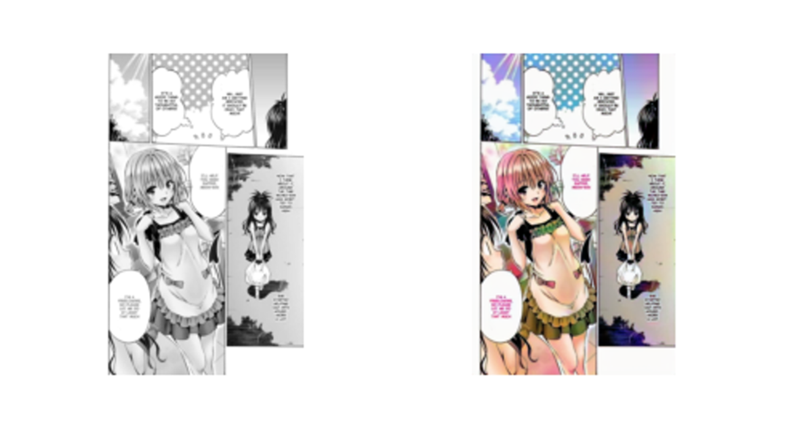

# Manga_colorization

It's 8 pm, you've just went back from work or school and you want to read your favorite manga.
Chapter 204, it's time for the final confession (and the story finally ends !). The characters are perfectly drawn, you can see their feeling overflowing, their eyes full of tears and the colors making this scene beautiful. WAIT, DID I JUST SAID THE COLORS? Yeah, now you wonder how it would be in color don' you? You want to see this sunset behind the protagonists and the reflecton the sea. Okay the manga in gray and white is a tradition but just this time why not seeing the world with colorful dreams?

This repo aims to colorize your favorite manga without denaturing the art and with enough consistency during the story.
It uses a Cycle-GAN base approach trained on unpaired images of grayshade and color manga panels.
An implementation with Pix2Pix Generator (ResNet and Unet) is also proposed to improve results. The obtention of paired images is simply done by grayscaling colored manga panels for simplicity.

## Installation

Just clone the repo and the requirements as usual
```
git clone https://github.com/Rubiksman78/Manga_colorization.git
pip install -r requirements.txt
```

## Structure

- networks: implementations of CycleGAN and Pix2Pix with a ResNET and a U-Net architecure. An implementation of a perceptual loss is also done with VGG-16 for Pix2Pix training.
- scripts: multiple scripts to convert pdf scans to images folder. There are also utils functions for plotting and training loops for both CycleGAN and Pix2Pix
- main.py : main script to train the model
- config.py : configuration dictionnary for experiments

## Results

